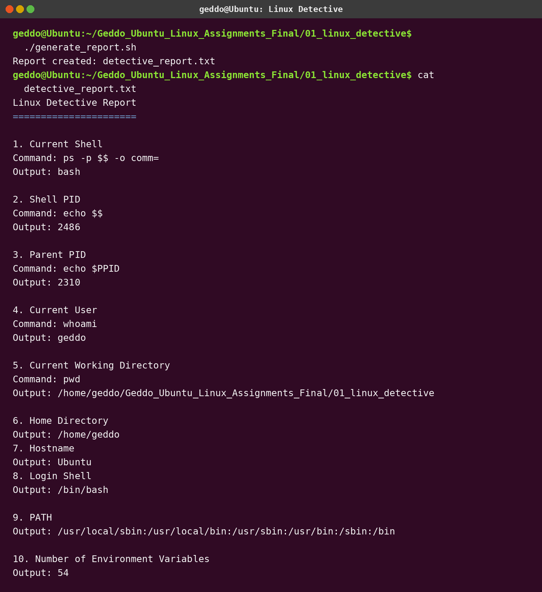

# Assignment 1 - Linux Detective

## Objective

Investigate the current Ubuntu shell and save the requested information in `detective_report.txt`.

## Files

```text
01_linux_detective/
├── generate_report.sh
├── detective_report.txt
├── README.md
└── screenshots/
    └── linux_detective.png
```

## Run

```bash
chmod +x generate_report.sh
./generate_report.sh
cat detective_report.txt
```

## Commands used

| Information | Command |
|---|---|
| Current shell | `ps -p $$ -o comm=` |
| Shell PID | `echo $$` |
| Parent PID | `echo $PPID` |
| Current user | `whoami` |
| Current directory | `pwd` |
| Home directory | `echo $HOME` |
| Hostname | `hostname` |
| Login shell | `getent passwd $USER \| cut -d: -f7` |
| PATH | `echo $PATH` |
| Environment-variable count | `env \| wc -l` |

## Screenshot


