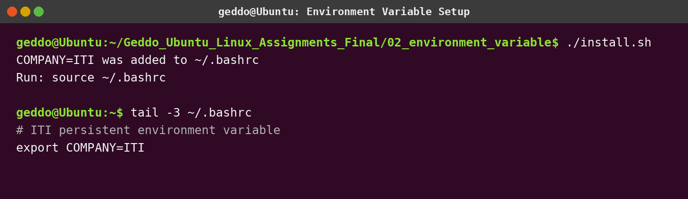
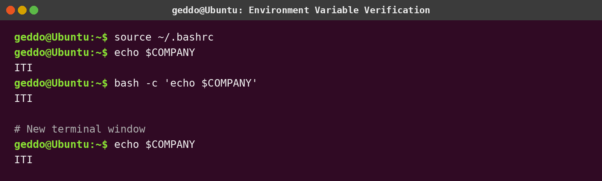

# Assignment 2 - Environment Variable Mystery

## Objective

Make `COMPANY=ITI` available in the current shell, child shells, and every newly opened Ubuntu terminal.

## Install

```bash
chmod +x install.sh verify.sh
./install.sh
source ~/.bashrc
./verify.sh
```

Then open a new terminal and run:

```bash
echo $COMPANY
```

## Why `~/.bashrc`?

Ubuntu's terminal normally opens an interactive Bash shell. Bash reads `~/.bashrc` for that shell, so the exported variable becomes available automatically in every new terminal.

## Screenshots




