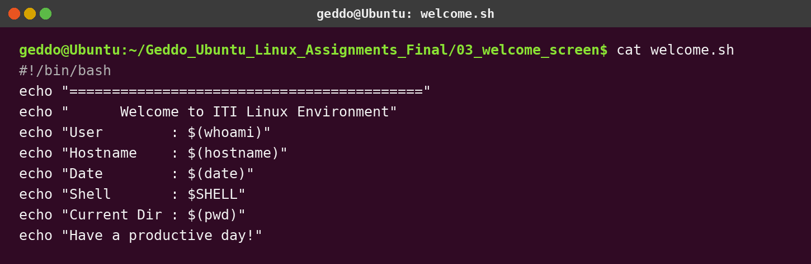
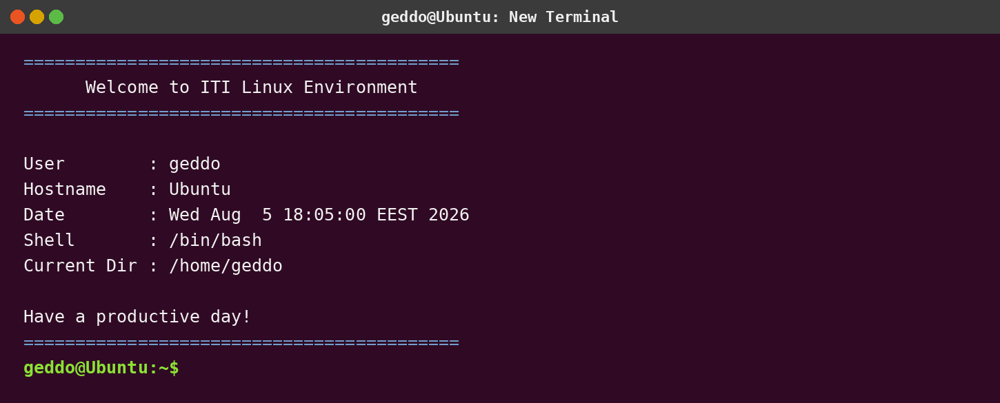

# Assignment 3 - Build Your Own Linux Shell Environment

## Objective

Display a welcome screen automatically whenever a new terminal starts. The user, hostname, date, shell, and current directory are produced dynamically.

## Install

```bash
chmod +x welcome.sh install.sh
./install.sh
```

Open a new terminal. The welcome screen should appear automatically.

## How it works

`install.sh` adds the following command to `~/.bashrc`:

```bash
source "/full/path/to/welcome.sh"
```

Because `~/.bashrc` is read by a new interactive Bash terminal, the welcome script runs during terminal startup.

## Screenshots




