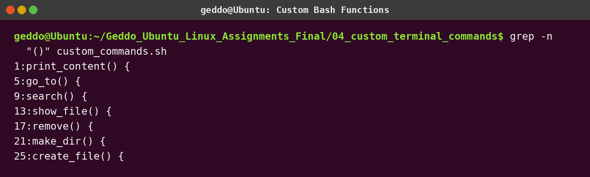
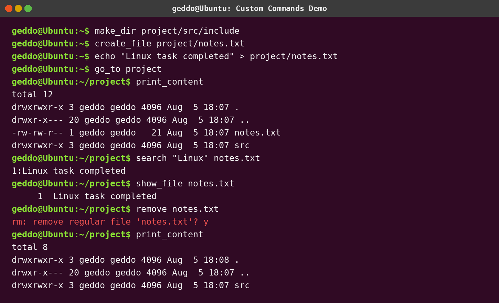

# Assignment 4 - Customize Your Linux Terminal

## Objective

Create seven custom Bash commands and make them available in every terminal.

| Custom command | Action |
|---|---|
| `print_content` | Runs `ls -la` |
| `go_to <directory>` | Changes the current directory |
| `search "keyword" filename` | Finds matching lines and highlights matches |
| `show_file filename` | Displays a file with line numbers |
| `remove filename` | Asks for confirmation before deletion |
| `make_dir path/to/folder` | Creates the complete directory hierarchy |
| `create_file filename` | Creates an empty file |

## Install

```bash
chmod +x install.sh
./install.sh
source ~/.bashrc
```

## Example

```bash
make_dir project/src/include
create_file project/notes.txt
echo "Linux task" > project/notes.txt
go_to project
print_content
search "Linux" notes.txt
show_file notes.txt
remove notes.txt
```

## Screenshots




