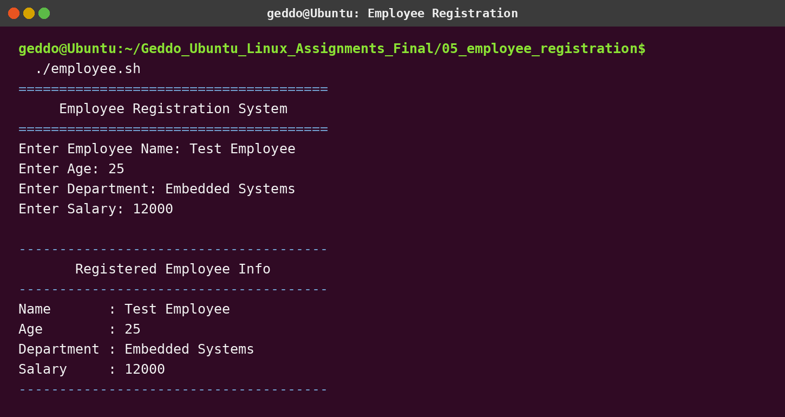

# Assignment 5 - Employee Registration System

## Objective

Create `employee.sh` to ask for an employee's name, age, department, and salary, then display the entered information.

## Run

```bash
chmod +x employee.sh
./employee.sh
```

## Concepts used

- Bash variables
- `read` for user input
- `echo` for formatted output

## Screenshot


