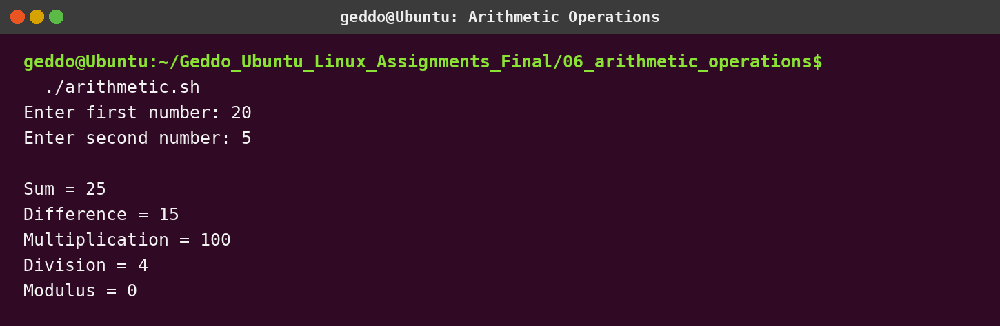

# Assignment 6 - Arithmetic Operations

## Objective

Ask the user for two integers and display their sum, difference, multiplication, division, and modulus.

## Run

```bash
chmod +x arithmetic.sh
./arithmetic.sh
```

## Concepts used

- User input with `read`
- Variables
- Bash arithmetic using `$(( ))`
- An `if` condition to prevent division by zero

## Screenshot


