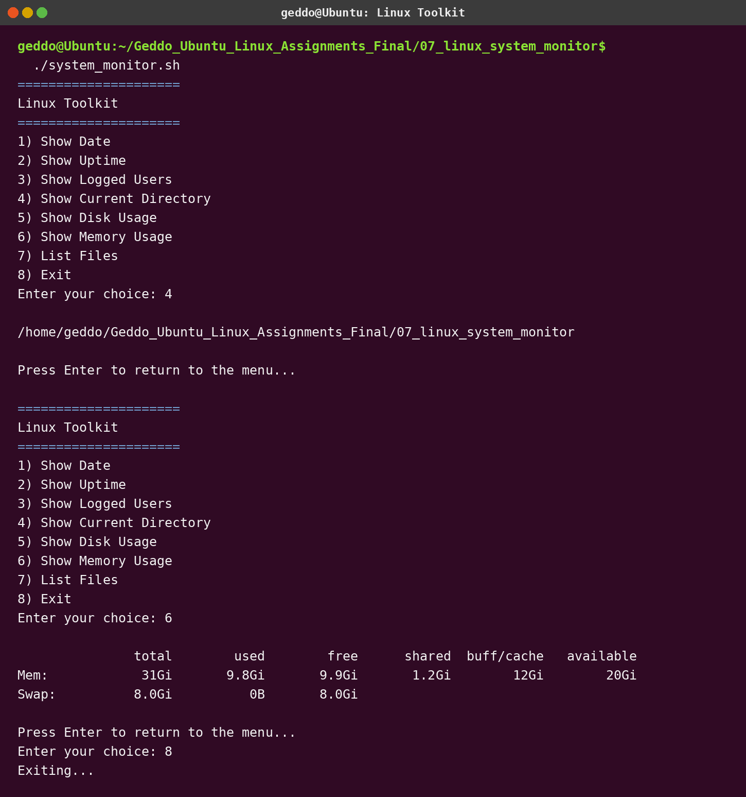

# Assignment 7 - Mini Linux System Monitor

## Objective

Create a menu-driven Linux toolkit with eight choices.

## Requirements implemented

- A separate function for every action
- A `while` loop to repeat the menu
- A `case` statement to handle the selected option
- Variables and command substitution to store command results

## Run

```bash
chmod +x system_monitor.sh
./system_monitor.sh
```

## Commands used

- `date`
- `uptime`
- `who`
- `pwd`
- `df -h`
- `free -h`
- `ls -la`

## Screenshot


