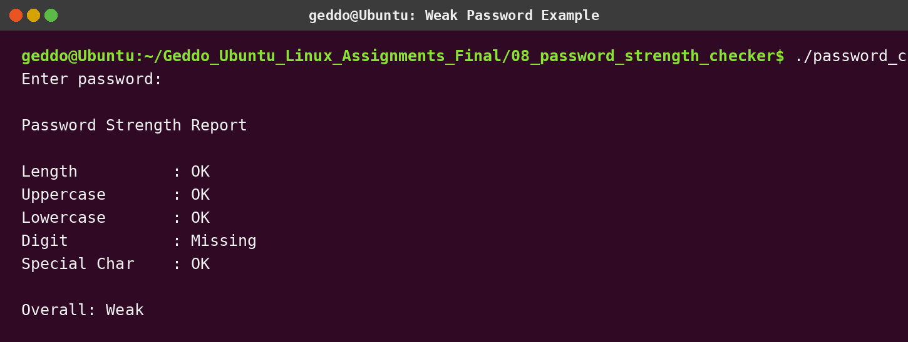
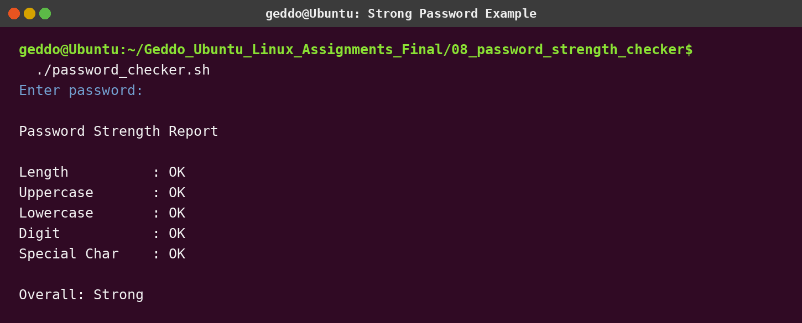

# Assignment 8 - Password Strength Checker

## Objective

Ask the user for a password and check whether it has:

- At least 8 characters
- An uppercase letter
- A lowercase letter
- A digit
- A special character

## Run

```bash
chmod +x password_checker.sh
./password_checker.sh
```

The password is entered silently because `read -s` is used. The result is **Strong** only when all five requirements are present; otherwise it is **Weak**, matching the assignment example.

## Concepts used

- String length with `${#password}`
- Pattern matching with `[[ ... =~ ... ]]`
- Variables
- Conditions

## Screenshots




